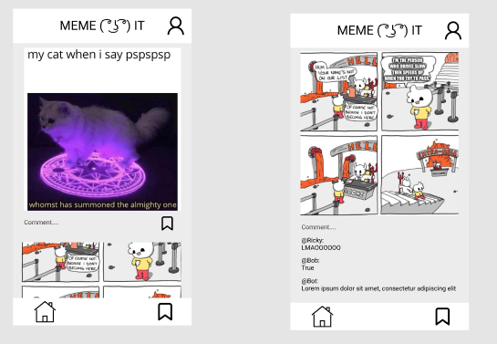

# MemeIt

## Table of Contents
1. [Overview](#Overview)
1. [Product Spec](#Product-Spec)
1. [Wireframes](#Wireframes)
2. [Schema](#Schema)

## Overview
### Description
[Description of your app]
- MemeIt is an application that displays different memes(GIFs) to users. Users are greeted with the "Meme of the Day" when opening the app. They will be able to upvote and downvote the meme. The user will then be taken to a feed of different memes where they will also be able to upvote/downvote  and save memes to their collection. 

### App Evaluation
[Evaluation of your app across the following attributes]
- **Category:** Social / Entertainment
- **Mobile:** View only, Mobile first, and interactive website.
- **Story:** Allows users to view trending memes(GIFs) and vote on which meme is the best.
- **Market:** Anyone can use the app, but mainly geared towards teen/young adult culture.
- **Habit:** Users can see different trending memes everyday, even if they open the app for 2 mins to see this and close it, we would have achieved our goal. 
- **Scope:** V1 would allow users to see the Meme of the Day on login success, this should be different each day, not on app opening. Users will also be able to save their favorite meme of the day in the app. They should also be able to see a feed of memes. All memes displayed can be upvted/downvoted by users. 

## Product Spec

### 1. User Stories (Required and Optional)

**Required Must-have Stories**

- [x]Authentication
- []Commenting 
- []Up/Down voting posts&comments
- []Rating System (Popularity of Memes)
- []Profiles
- [x]save memes to a db
- []save memes to profile

**Optional Nice-to-have Stories**

* Advance Settings such chanage password
* a friend list of users

### 2. Screen Archetypes

* Login
    * Authentication
* Signup
    * User Can Create an account
* Daily Meme
    * Opening the app (after authentication), User will be greeted with the "Meme of the day".
    * User can upvote/downvote the meme of the day
* Stream/Feed
    * User can view the different memes on the feed
    * User Can upvote/downvote different memes
* Profile
    * User can upload a profile picture
    * User can view profile information 
    * User can view saved memes

### 3. Navigation

**Tab Navigation** (Tab to Screen)

* Profile
* Stream
* Login
* Signup
* Daily Meme
* Details

**Flow Navigation** (Screen to Screen)
* Signup
   * Login
* Login
   * Daily Meme
* Daily Meme
    * Feed
* Profile
    * Profile Details

## Wireframes

<a href="https://www.figma.com/file/uMXsqUTxVufKDXK8w7G2ud/Untitled?node-id=0%3A1">Link!

### [BONUS] Digital Wireframes & Mockups

### [BONUS] Interactive Prototype

## Schema 

-user(username,password,email)
-meme(name,url,votes)
-comment(user_reference, meme_reference, votes, comment_content) 
-register(email,username,password)
-login(email,password)
-voting(meme_reference,up/down_vote)

### Models
- User
    - ObjectID
    - Username
    - Password
    - Email
    - SavedMemes
- Meme 
    - ObjectID
    - MemeName
    - MemeURL
    - UpvoteVal
    - DownvoteVal
- Comment(Array of userobjects) <-- Maybe do this as a separate model.
    - ObjectID
    - MemeReference
    - UserReference
    - CommentString
    - CommentUpvoteVal
    - CommentDownvoteVal
    - CreatedAt
- 
[Add table of models]
## User
|  Property | Type | Description |
| -------- | -------- | -------- |
| ObjectID     | String    | unique ID for users created     
| Username |    String | Screenname for user, credential for login
|    Password | String | Credential for login |
|    Email | String | Email verification, Credential for login |
|    Saved Memes| Array of Memes | A collection of saved memes the users have bookmarked|

## Meme
| Property | Type | Description |
| -------- | -------- | -------- |
| ObjectID     | String     | Unique ID for different memes displayed     |
|MemeName   |  String    |   Title of the Meme     |
|MemeURL    |   String     |   Contains the actual URL image to display the meme     |
|UpvoteVal     |    Number    |    Value to display and update liked memes    |
|DownvoteVal    |  Number      |   Value to display and update disliked memes     |

## Comment (Stretch if there is time)

| Property | Type | Description |
| -------- | -------- | -------- |
| ObjectID   | String     | Unique ID for different user comments |
| MemeReference   | Refernce     | ObjectID of Meme the comment relates to     |
| UserReference   | Refernce     | ObjectID of User who created post |
| CommentString   | String     | User's Comment     |
| CommentUpvoteVal   | Int     | Number of Upvotes for comment     |
| CommentDownvoteVal   | Int     | Number of Downvotes for comment     |
| CreatedAt  | Date    | Date/Time Comment was Created     |

### Networking
- [Add list of network requests by screen ]
- GET
- POST
- DELETE
- UPDATE 
- [Create basic snippets for each Parse network request]
- [OPTIONAL: List endpoints if using existing API such as Yelp]

- ** API_KEY will be different for everyone else if not hardcoding it.** 
- 

## Base URL: - https://api.giphy.com/v1/gifs/trending

| HTTP Verb | Endpoint | Description|
| -------- | -------- | -------- |
| GET    | Trending     | Takes all Trending Memes from GIPHY API     |
|

Register for API key here: https://developers.giphy.com/

Giphy will actully generate the url needed for the endpoint/array of memes
